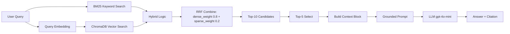

# Architecture — RAG Pipeline (Day 08 Lab)

> Template: Điền vào các mục này khi hoàn thành từng sprint.
> Deliverable của Documentation Owner.

## 1. Tổng quan kiến trúc

```
[Raw Docs]
    ↓
[index.py: Preprocess → Chunk → Embed → Store]
    ↓
[ChromaDB Vector Store]
    ↓
[rag_answer.py: Query → Retrieve → Rerank → Generate]
    ↓
[Grounded Answer + Citation]
```

**Mô tả ngắn gọn:**
> Hệ thống RAG Pipeline chúng tôi xây dựng là một trợ lý ảo nội bộ hỗ trợ trả lời các câu hỏi về chính sách IT, HR và CS. Hệ thống được xây dựng cho nhân viên công ty sử dụng, giúp giảm thiểu rào cản tìm kiếm thông tin bằng cách trích xuất ngữ cảnh trực tiếp và tổng hợp câu trả lời tự nhiên qua mô hình ngôn ngữ lớn (LLM), đảm bảo tính chính xác thông qua trích dẫn nguồn.

---

## 2. Indexing Pipeline (Sprint 1)

### Tài liệu được index
| File | Nguồn | Department | Số chunk |
|------|-------|-----------|---------|
| `policy_refund_v4.txt` | policy/refund-v4.pdf | CS | ~14 |
| `sla_p1_2026.txt` | support/sla-p1-2026.pdf | IT | ~24 |
| `access_control_sop.txt` | it/access-control-sop.md | IT Security | ~22 |
| `it_helpdesk_faq.txt` | support/helpdesk-faq.md | IT | ~25 |
| `hr_leave_policy.txt` | hr/leave-policy-2026.pdf | HR | ~21 |

### Quyết định chunking
| Tham số | Giá trị | Lý do |
|---------|---------|-------|
| Chunk size | 400 tokens (~1600 ký tự) | Kích thước lý tưởng giúp cân bằng việc chứa đủ ngữ cảnh mà không làm tải quá nhiều cho LLM context. |
| Overlap | 80 tokens (~320 ký tự) | Tránh nguy cơ cụt bớt thông tin (lost context) giữa chừng khi cắt chunk đoạn câu. |
| Chunking strategy | Heading-based / paragraph-based | Tách trước theo section `===`, nếu phần vượt giới hạn kích thước tiếp tục cắt linh hoạt nhờ cấu trúc ký tự xuống dòng `\n\n`. |
| Metadata fields | source, section, effective_date, department, access | Phục vụ filter, freshness, citation |

### Embedding model
- **Model**: OpenAI text-embedding-3-small
- **Vector store**: ChromaDB (PersistentClient)
- **Similarity metric**: Cosine

---

## 3. Retrieval Pipeline (Sprint 2 + 3)

### Baseline (Sprint 2)
| Tham số | Giá trị |
|---------|---------|
| Strategy | Dense (embedding similarity) |
| Top-k search | 10 |
| Top-k select | 3 |
| Rerank | Không |

### Variant (Sprint 3)
| Tham số | Giá trị | Thay đổi so với baseline |
|---------|---------|------------------------|
| Strategy | Hybrid (RRF) | Đổi từ Dense sang Hybrid |
| Top-k search | 10 | Không đổi |
| Top-k select | 5 | Tăng từ 3 lên 5 để thu thập nhiều chunk hơn |
| Rerank | Không (RRF weighting đóng vai trò rerank) | Cập nhật `dense_weight=0.8`, `sparse_weight=0.2` |
| Query transform | Không | Giữ nguyên |

**Lý do chọn variant này:**
> Chọn Hybrid kết hợp vì dữ liệu có chứa cả câu mô tả chung và rất nhiều danh từ chuyên ngành (như "P1", "ERR-403", "Flash Sale"). Tuy nhiên, tokenizer tiếng Việt của BM25 lại tách khoảng trắng (whitespace) dẫn đến nhiều từ nhiễu. Bằng cách thiết lập `dense_weight = 0.8` và `sparse_weight = 0.2`, hệ thống duy trì được tính chính xác dựa trên semantic (dense) cao của Model OpenAI, nhưng không làm mất lợi thế exact-match bổ trợ của keyword đến từ BM25.

---

## 4. Generation (Sprint 2)

### Grounded Prompt Template
```
Answer only from the retrieved context below.
If the context is insufficient, say you do not know.
Cite the source field when possible.
Keep your answer short, clear, and factual.

Question: {query}

Context:
[1] {source} | {section} | score={score}
{chunk_text}

[2] ...

Answer:
```

### LLM Configuration
| Tham số | Giá trị |
|---------|---------|
| Model | gpt-4o-mini |
| Temperature | 0 (để output ổn định cho eval) |
| Max tokens | 512 |

---

## 5. Failure Mode Checklist

> Dùng khi debug — kiểm tra lần lượt: index → retrieval → generation

| Failure Mode | Triệu chứng | Cách kiểm tra |
|-------------|-------------|---------------|
| Index lỗi | Retrieve về docs cũ / sai version | `inspect_metadata_coverage()` trong index.py |
| Chunking tệ | Chunk cắt giữa điều khoản | `list_chunks()` và đọc text preview |
| Retrieval lỗi | Không tìm được expected source | `score_context_recall()` trong eval.py |
| Generation lỗi | Answer không grounded / bịa | `score_faithfulness()` trong eval.py |
| Token overload | Context quá dài → lost in the middle | Kiểm tra độ dài context_block |

---

## 6. Diagram (tùy chọn)

Sơ đồ thể hiện chu trình xử lý Retrieval Pipeline của Baseline (Dense) và Variant (Hybrid).


